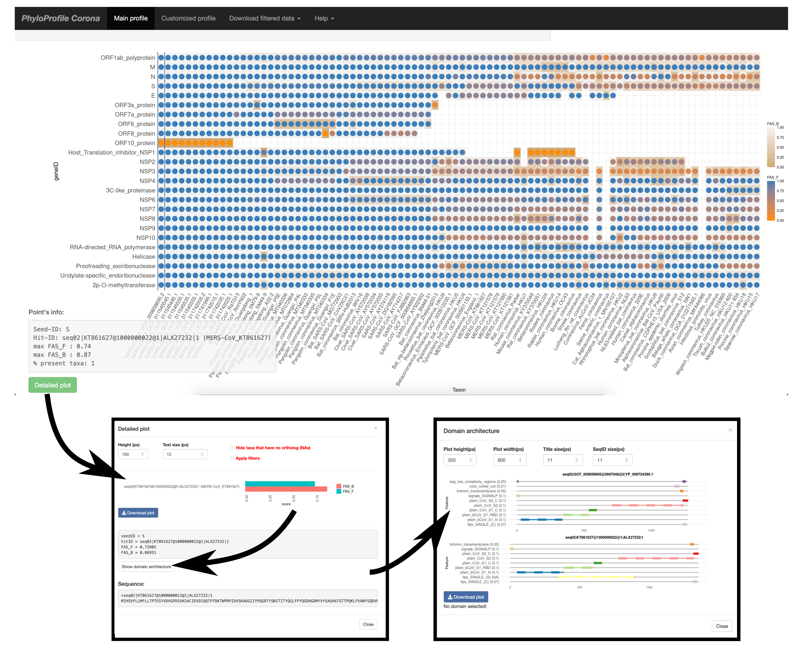

# PhyloProfileCorona

The data of PhyloProfile Corona is displayed for an interactive exploration of the [feature-aware phylogenetic profile of isolates from the Coronaviridae family](https://applbio.biologie.uni-frankfurt.de/phyloprofilecorona/).
This is a lite version of [PhyloProfile](https://github.com/BIONF/PhyloProfile), which is pre-configured only for its use with the [Coronavirus data](https://applbio.biologie.uni-frankfurt.de/download/SARS-CoV-2/).

# Table of Contents
* [Usage](#usage)
* [Bugs](#bugs)
* [License](#license)
* [Contact](#contact)

<!--  -->

# Usage
Feature-aware phylogenetic profile of the SARS-CoV-2 protein set (GCF_009858895.2) across the Coronaviridae family.
* Taxa (x-axis) are ordered with increasing evolutionary distance to SARS-CoV-2. The dataset covers samples in the respective order from betacoronaviruses (Sarbecovirus, Hibecovirus, Nobecovirus, Merbecovirus, and Embecovirus), alpha-, gamma-, and deltacoronaviruses.
* Rows indicate the reference protein set of SARS-CoV-2, which comprises core proteins, accessory proteins, and polyprotein components. Abbreviations: M – membrane glycoprotein, N – nucleocapsid protein, S – spike glycoprotein, E – envelope protein, ORF - open reading frame, NSP - non-structural protein.
* Dots indicate orthologs of each protein in the respective isolate. To inspect the domain architecture comparison between the protein in SARS-CoV-2 and the one from the datapoint, click on the dot, select detailed plot, select the ortholog from the barplot, and click on show domain architecture.
* The color scheme represents the similarity of annotated features between SARS-CoV-2 proteins and the respective orthologs using the FAS scores ([Koestler, et al. 2010](https://bmcbioinformatics.biomedcentral.com/articles/10.1186/1471-2105-11-417)) by assigning values between 0 and 1. The score is penalized for missing features (FAS_F; dot color) and added features (FAS_B; background color) in the orthologous protein. For instance, a protein with an identical feature architecture to the reference protein in SARS-CoV-2 would have FAS_F = 1 and FAS_B = 1, and would appear as a blue dot in a light-grey background according to the color scale.
* For further details on the biological interpretation of the data, please refer to the article [The evolutionary making of SARS-CoV-2](https://www.biorxiv.org/content/10.1101/2021.01.29.428808v2).

# Bugs
Any bug reports or comments, suggestions are highly appreciated. Please [open an issue on GitHub](https://github.com/BIONF/PhyloProfileCorona/issues/new) or be in touch via email.

# License
This tool is released under [MIT license](https://github.com/BIONF/PhyloProfile/blob/master/LICENSE).

# Contact
Ingo Ebersberger
ebersberger@bio.uni-frankfurt.de
