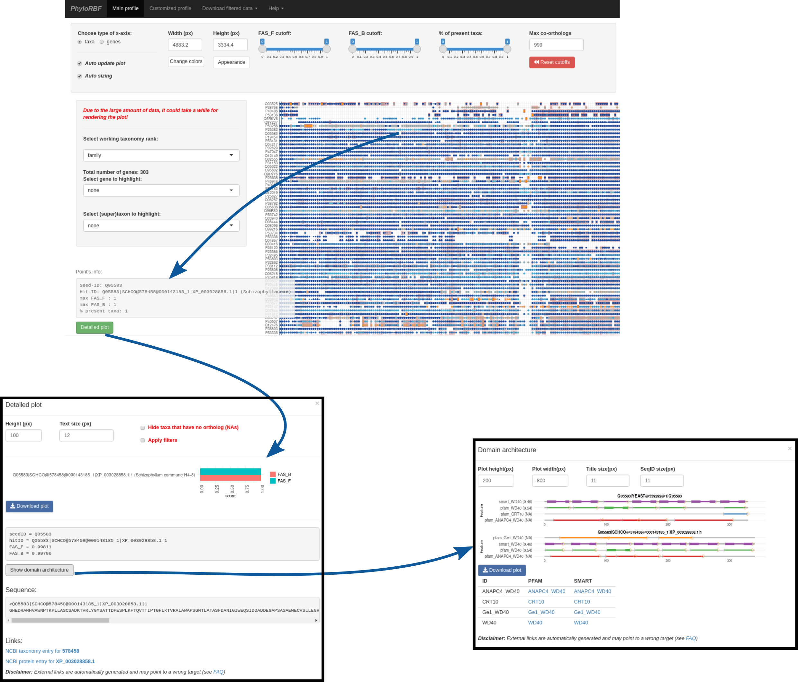

# PhyloProfileRibi

The data of PhyloProfile Ribosome Biogenesis is displayed for an interactive exploration of the [feature-aware phylogenetic profile of ???](https://applbio.biologie.uni-frankfurt.de/phyloprofileribi/).
This is a lite version of [PhyloProfile](https://github.com/BIONF/PhyloProfile), which is pre-configured only for its use with the [Ribosome biogenesis data](https://applbio.biologie.uni-frankfurt.de/download/RibosomeBiogenesis/).

# Table of Contents
* [Usage](#usage)
* [Bugs](#bugs)
* [License](#license)
* [Contact](#contact)

<!--  -->

# Usage
Feature-aware phylogenetic profile of the yeast ribosome biogenesis genes across 982 taxa (WHAT ARE THEY?).
* Taxa (x-axis) are ordered with increasing taxonomic distance to *Saccharomyces cerevisiae S288C*.
* Rows indicate the ribosome biogenesis protein set of yeast.
* Dots indicate orthologs of each protein in the respective taxon. To inspect the domain architecture comparison between the protein in yeast and the one from the datapoint, click on the dot, select detailed plot, select the ortholog from the barplot, and click on show domain architecture.
* The color scheme represents the similarity of annotated features between yeast proteins and the respective orthologs using the FAS scores ([Koestler, et al. 2010](https://bmcbioinformatics.biomedcentral.com/articles/10.1186/1471-2105-11-417)) by assigning values between 0 and 1. The score is penalized for missing features (FAS_F; dot color) and added features (FAS_B; background color) in the orthologous protein. For instance, a protein with an identical feature architecture to the reference protein in yeast would have FAS_F = 1 and FAS_B = 1, and would appear as a blue dot in a white background according to the color scale.
* For further details on the biological interpretation of the data, please refer to the article [DO WE HAVE A LINK SOMEWHERE](https://www.biorxiv.org/content/10.1101/2021.01.29.428808v2).

# Bugs
Any bug reports or comments, suggestions are highly appreciated. Please [open an issue on GitHub](https://github.com/BIONF/PhyloProfileRibi/issues/new) or be in touch via email.

# License
This tool is released under [MIT license](https://github.com/BIONF/PhyloProfileRibi/blob/master/LICENSE).

# Contact
Ingo Ebersberger
ebersberger@bio.uni-frankfurt.de
